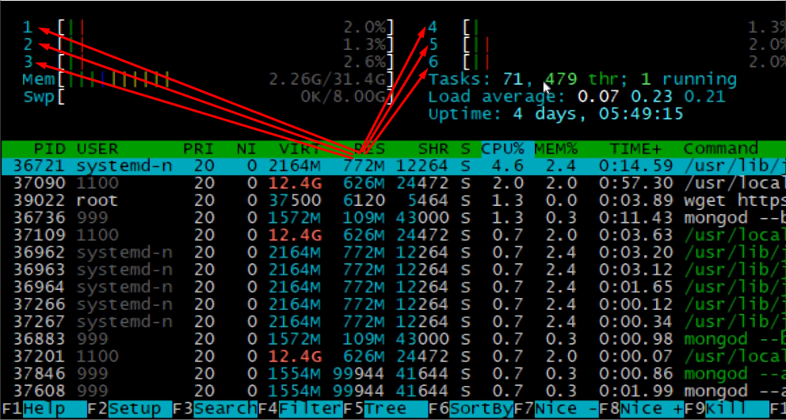
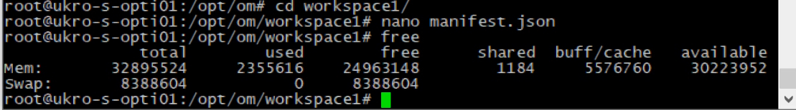
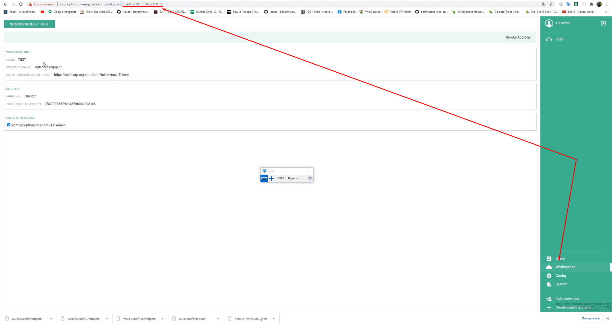
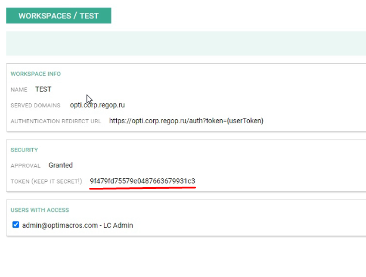
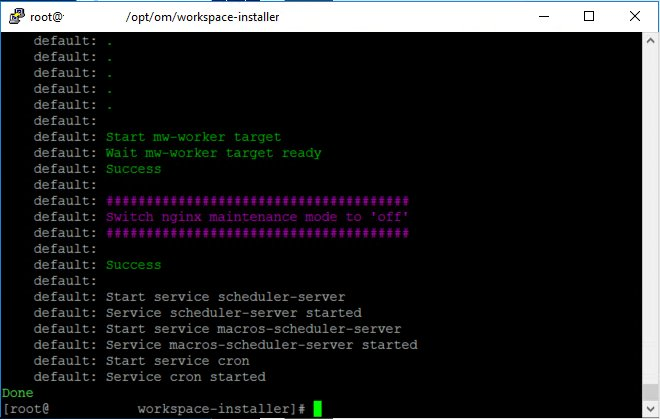

# Чистая установка дистрибутива на клиентский сервер:

Сначала устанавливаем всё наобходимое для работы Optimacros, согласно инструкции по предварительным установкам ПО, 
необходимых для работы Optimacros. Так же установка воркспейса предполагает, что уже установлен для данного ворксмпейса 
логин центр либо на текущем сервере, либо на отдельном отведённым под логин центр. Так же предполагается, что на сервере 
уже скачан дистрибутив воркспейса `installer-версия.tar`

[Предварительные установки ПО необходимые для работы Optimacros](softInstall.md)

Сначала переходим в директорию `/opt/om/`, затем создаём там директорию `workspace1` с помощью команды: 
 
 ```mkdir workspace1```
 
Затем перемещаемся в директорию `workspace1` с помощью команды `cd workspace1` и создаём в ней файл `manifest.json` 
с помощью команнды `nano manifest.json` после выполнения, которой попадаем в режим редактирования данного файла.  Вот 
стандартный вид файла `manifest.json`:

```
{
  "container": {
    "ip": "10.0.3.15",
    "cpu": 6,
    "memory": 33685016576,
    "ports": {},
    "hosts": {},
  },
  "workspace": {
    "id": "8522aedecc6b4219ee87ee28",
    "name": "TEST",
    "web": {
      "url": "https://om.test.workspace.ru"
    },
    "loginCenter": {
      "url": "https://lc.company.ru/",
      "token": "4aed337a0ac34dd13716c476a4c7",
      "apiUrl": "wss://lc.company.ru/api/ws/v1/"
    },
    "admin": {
      "email": "admin@optimacros.com"
    }
  }
}
```

Далее сохраняем документ со стандартным содержимым, и приступаем к сбору информации для корректного заполнения свойств 
для текущего сервера. Пройдёмся по свойствам объекта `container`, `id` всегда остаётся неизменным и равен `"10.0.3.15"`.
`cpu` соответствует количеству ядер процессора на текущем сервере, это мы можем узнать например воспользовавшсь утилитой
htop введя команду `htop`



Считаем ядра и видим, что их 6 на данном воркспейсе значит в `cpu` вводим значение 6. Теперь мы должна запомнить значение
 свойства `memory` которая соответствует количеству оперативной памяти сервера в байтах. Для того, чтобы это узнать 
 воспользуемся командой `free` 
 


Где в выводе 32895524 это значение количества памяти в килобайтах, умножаем это на 1024, чтобы узнать в байтах и 
получаем: 33685016576 вводим это значение в cpu в нашем манифесте.

Далее нам нужно ввести `workspace.id` его мы получаем, открыв логин центр и перейдя в раздел `Workspaces`. 



Затем в адресной строке браузера копируем всё после последнего слеша. Вводим это в `workspace.id`. Затем в 
`workspace.name` вводим название воркспейса который мы создаём, допустим `TEST` для тестового воркспейса или `PROD` для 
продакшн. В `workspace.web.url` вводим URL нашего воркспейса.

Переходим к заполнению настроек логин центра в файлике манифест:
`workspace.loginCenter.url` вводим URL нашего логин центра, в `workspace.loginCenter.token` берём токен в месте 
отмеченным красной линией на скриншоте:


 

Затем в `workspace.loginCenter.apiUrl` изменяем только домен оставляя протокол и путь, получится типа: 
`wss://нашДоменЛогинЦентра/api/ws/v1/`. Ну и на последок вводим `admin.email` где в качестве значение указываем строку с
мейлом учётной записи администратора воркспейса.

Шпаргалка с краткими комментариями по свойствам файла манифест

```
{
  "container": {
    "ip": "10.0.3.15", // данный IP остаётся неизменным
    "cpu": 6, // количество ядер на сервере
    "memory": 33685016576, //количество опертивной памяти
    "ports": {},
    "hosts": {},
  },
  "workspace": {
    "id": "8522aedecc6b4219ee87ee28", // берётся в адресной строке прямо в логин центре при переходе к воркспейсу
    "name": "TEST", // название воркспейса
    "web": {
      "url": "https://om.test.workspace.ru" // URL создаваемого воркспейса
    },
    "loginCenter": {
      "url": "https://lc.company.ru/", // URL относящегося к воркспейсу логин центра
      "token": "4aed337a0ac34dd13716c476a4c7", // URL относящегося к воркспейсу логин центра
      "apiUrl": "wss://lc.company.ru/api/ws/v1/" // изменяем только домен на свой, оставляя протокол и путь
    },
    "admin": {
      "email": "admin@optimacros.com" // почтовый ящик пользователя администратора воркспейса
    },
    "console": {
      "commands": {
        "frontend-build": {
          "appCongig": {
            "flags": [
                "fun_loader_message_off", // отключает "веселые" сообщения при первичной загрузке
                "interface_theme_optimacros", // по умолчанию фиолетовая тема с тайтлом Optimacros и своим фавиконом
                "color_scheme_advexcel", // цветовая схема advexcel доступна для выбора в настройках
                "color_scheme_optimacros", // цветовая схема optimacros доступна для выбора в настройках
                "color_scheme_olapsoft", // цветовая схема olapsoft доступна для выбора в настройках
                "color_scheme_corplan", // цветовая схема corplan доступна для выбора в настройках
                "color_scheme_orange", // цветовая схема orange доступна для выбора в настройках
                "interface_language_RU", // руский язык доступен для выбора в настройках
                "interface_language_EN", // английский язык доступен для выбора в настройках
                "support_email_support@optimacros.com", // email для связи support@optimacros.com
            ]
          }
        }
      }
    }
  }
}
```

С настройкой манифеста мы закончили, теперь нам нужно выйти из директории workspace1 с помощью команды `cd ..` и мы 
вновь попадаем в директорию `/opt/om/` и нужно создать здесь директорию `workspace-installer` с помощью кманды 
`mkdir workspace-installer` переходим в неё `cd workspace-installer` и вводим последовательно команды:

`mkdir current` Создали директорию current для распаковки в неё установочных файлов из архива с дистрибутивом.

`tar -xf /home/user/installer-версия.tar -C current` Распаковыаем архив с дистрибутивом в диресторию current где 
`/home/user/` это путь где скачан наш архив.

Затем запускаем команду поднятия воркспейса:

```current/install workspace --path /opt/om/workspace1/manifest.json up```

И наблюдаем чтобы весь процесс поднятия прошёл успешно, по окончанию процесса видим такой вывод:



Установка воркспейса завершена!

[Вернуться к содержанию <](contents.md)

[Вернуться к оглавлению <<](index.md)