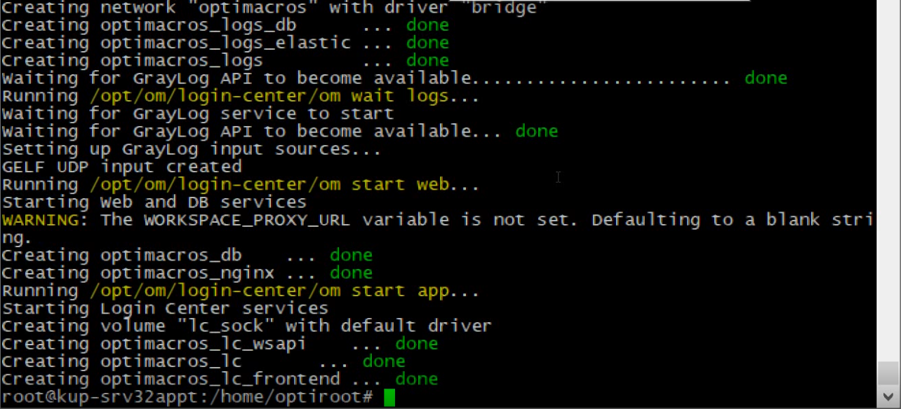

# Чистая установка Логин Центра на клиентский сервер:

Подключаемся к серверу через ssh протокол.

Переходим в аккаунт root с помощью команды `sudo su`

Затем скачиваем дистрибутив логин центра церез терминал с помощью команды: 

`wget https://nextcloud.optimacros.com/s/iRtXDicQGye4RHG/download -O ИМЯ_ФАЙЛА.С_РАСШИРЕНИЕМ`

В случае, если на сервере уже установлен воркспейс, то необходимо завершить его работу. Предварительно открыв файл 
manifest.json, чтобы убедиться, что мы находимся на нужном сервере. Переходим в директори с файлом как правило это:
`/opt/om/worksapce1` и выполняем команду `cat manifest.json`

После того как мы удостоверились что находимся на нужном сервере (TEST или PROD). Завершаем работу воркспейса.

Далее нам необходимо установить на сервере docker. Устанавливаем его, следуя инструкции из его официального сайта:

https://docs.docker.com/engine/install/ubuntu/

Далее мы создаём директорию на сервере под логин центр по пути: `/opt/om/login-center`

Для этого переходим в папку om с помощью команды: `cd /opt/om/` и создаём там директорию login-center с помощью команды
`mkdir login-center`

Теперь когда мы подготовили папку для установки логин центра и скачали дистрибутив, нам необходимо будет установить его 
в созданную папку. Для этого переходим в директорию с дистрибутивом с помощью команды `cd /home/user/` выдаём файлу 
 права с помощью команды `chmod +x login-center-версия.sh` и запускаем инсталятор с помощью поманды 
 `./login-center-версия.sh` во время установки инсталятор попросит подтверидть установку логин центра в дефолтную 
 директорию по пути, которому мы как раз и подготовили директори. Текущая версия инсталятора устанавливает логин центр с
  дефолтными настройками подключения, которые нам предстоит настроить вручную, далее нынешняя версия инталятора  выдаёт 
  ошибку со следющим содержимым:
 

Которая нам говорит о том, что по заданным путям отстутсвуюют файлы сертификатов. Затем мы переходим в директорию где 
лежит логин центр `cd /opt/om/login-center`

Затем мы смотрим содержимое файла .env с помощью команды `cat .env`

Теперь нам нужно будето сконфигурировать файл .env, но сначала мы должны посмотреть какие контейнеры нам уже удалось 
установить, при установке логин центра с помощью команды `docker ps -a`

И посмотреть директорию data `ls -la data`

Видим что логин центр прервал установкук на самом начальном этапе, до устанвки базы данных. Теперь мы можем смело 
редактировать .env файл согласно нашим требованиям. В частности поменять пароли к аккаунту админа, пароли к базе 
данных и информацию о web части. 

Для пароля базы данных воспользуемся любым генератором паролей в интернете, сгенерировав надёжный пароль длинной более 
20 символов. Для программы graylog так же генерируем пароль, а затем генерируем к нему sha хэш пароль, воспользовавшись 
сервисом: http://emn178.github.io/online-tools/sha256.html . После настройки всех пунктов, сохраняем в надёжном месте 
env файл.

Затем вовращаемся к нашей проблеме во время установки логин центра. Переходим в папку с сертификатами с помощью команды
`cd /opt/om/login-center/data/nginx/cert` После чего, находясь в папке для сертификатов, мы генерируем сами сертификаты 
с помощью команды 

`openssl req -newkey rsa:2048 -nodes -keyout crt.key -x509 -days 1095 -out bundle.crt`

Отвечаем на вопросы, которые задаст программа генерации и на этом с генерацией сертификатов мы заканчиваем.

Затем мы переходим снова в папку с инсталятором логин центра с помощью команды: `cd /home/user/` и запускаем инсталятор 
`./login-center-версия.sh` 

Во время установки на вопрос, нужо ли перезаписывать env файл конечно же отвечаем нет. Ожидаем процесс установки.

Затем увидим вот такую консоль, это значит что логин центр успешно установлен.

[Вернуться к содержанию <](contents.md)

[Вернуться к оглавлению <<](index.md)