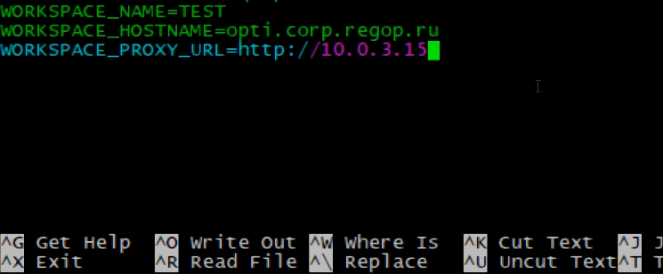
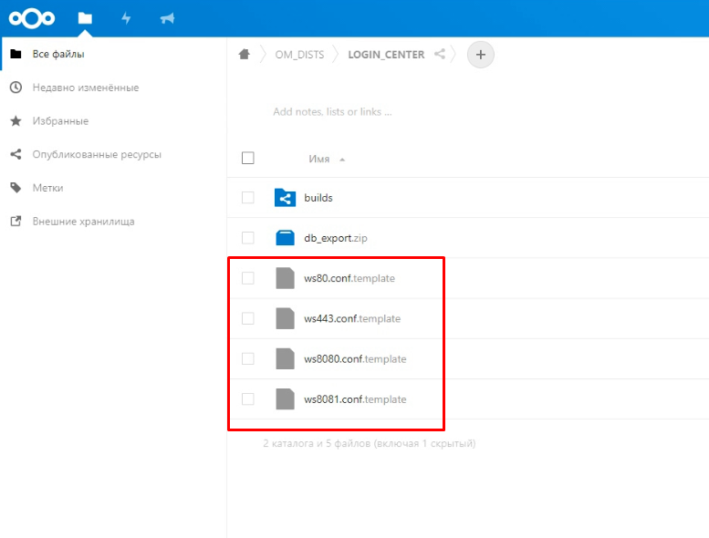
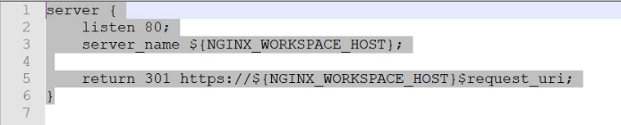
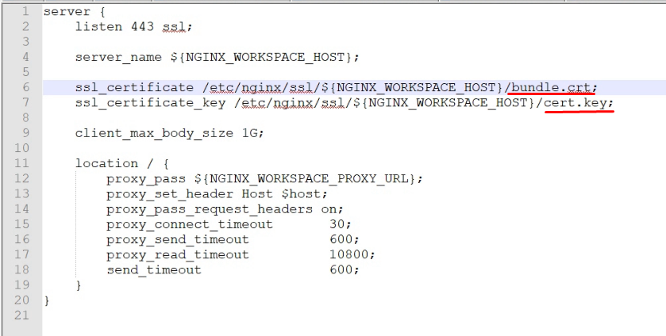
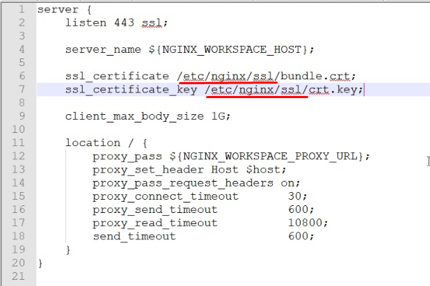
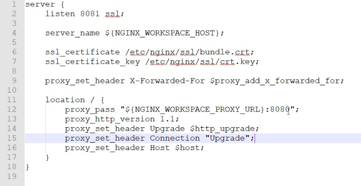
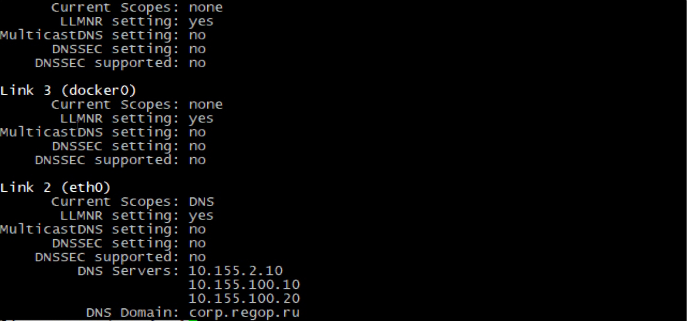
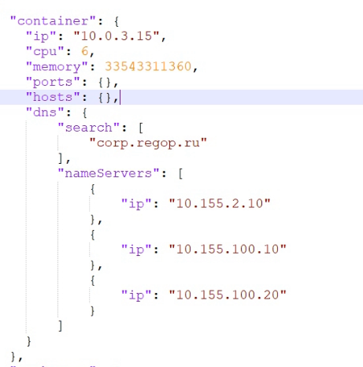

# Настройка Логин Центра и воркспейса, установленных на одном сервере:

Сначала устанавливаем логин центр и воркспейс, по соответствующим инструкциям в Содержании.

[Чистая установка Логин Центра](cleanInstallationLc.md)

[Чистая установка дистрибутива воркспейса Optimacros](cleanInstallation.md)

После установки логин центра и воркспейса.
Для начала нам необходимо в логин центре в файлике .env добавить переменную `WORKSPACE_PROXY_URL` и указать ей 
значение: `http://10.0.3.15`

Далее нам необходимо залить на сервер templates, чтобы воспользоваться нашими переменными окружения, они находятся на 
nextcloud'е:

Скачиваем их себе на компьютер для дальнейшего редактирования, исправляя моменты, которые у нас изменились согласно 
окружению и добавляем templates на сервер.

Переходим в терминале в директорию `login-center/data/nginx/templates`

Набираем команду: `nano ws80.conf.template` и вставляем содержимое скачанного темплейта в терминал. 

После чего сохраняем файл.

Затем набираем команду `nano ws443.conf.template`

Открываем на компьютере содержимое скачанного из Nextcloud файла `ws443.conf.template` изменяем названия файлов 
наших сертификатов в соответствии с тем какие у нас в директории `login-center/data/nginx/sert` 

И изменяем пути к файлам сертификатов на соответствующие

Вставляем содержимое в создаваемый на сервере файл `ws443.conf.template` и сохраняем содержимое.

Аналогичным образом открываем скачанный файл `ws8081.conf.template` и редактируем в нём имена и пути к файлам 
сертификатов и так как мы решили оставить ан ssl только логин центр изменяем порт с 8081 на 8080 в location в proxy_pass

Создаём файл `ws8081.conf.template` на сервере и вставляем в него содежримое нашего отредактированного файла 
`ws8081.conf.template`

Далее создаём файл `ws8080.conf.template` и помещаем содержимое скачанного файла с соответсвующим названием, в 
неизменном виде.

Затем нам необходимо сделать стоп\старт логин центра, перейдя в его root директорию и воспользовавшись утилитой `om`, 
используя команды `./om stop` и затем `./om start`

С настройкой логин центра пока закинчиваем и переходим к найстройке файла воркспейса `manifest.json`

В первую очередь, что нам нужно изменить относитеьно стандартного файла манифеста это свойство `dns` для того, в ОС 
Ubuntu узнать список имеющихся DNS можно воспользоваться командой `system-resolve --status` после чего курсором на 
клавиатуре скроллим вывод команды в самый низ и смотрим список DNS Servers:

То содержимое, котороые мы наблюдаем в `DNS Servers:` помещаем в массив объектов с ключом `id` и текстовым значением DNS
 по пути `container.dns.nameServers` (обязательно соблюдаем порядок перечисления DNS), а то что в `DNS Domain:` помещаем
  в массив строк по пути `container.dns.search` в файле манифеста. Свойство `container` в манифесте будет выглядеть 
  примерно вот так:
  

На этом всё. Это всё что нужно сконфигурировать, для работы логин центра и воркспейса на одном сервере.

[Вернуться к содержанию <](contents.md)

[Вернуться к оглавлению <<](index.md)
