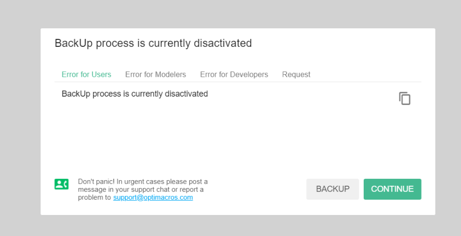
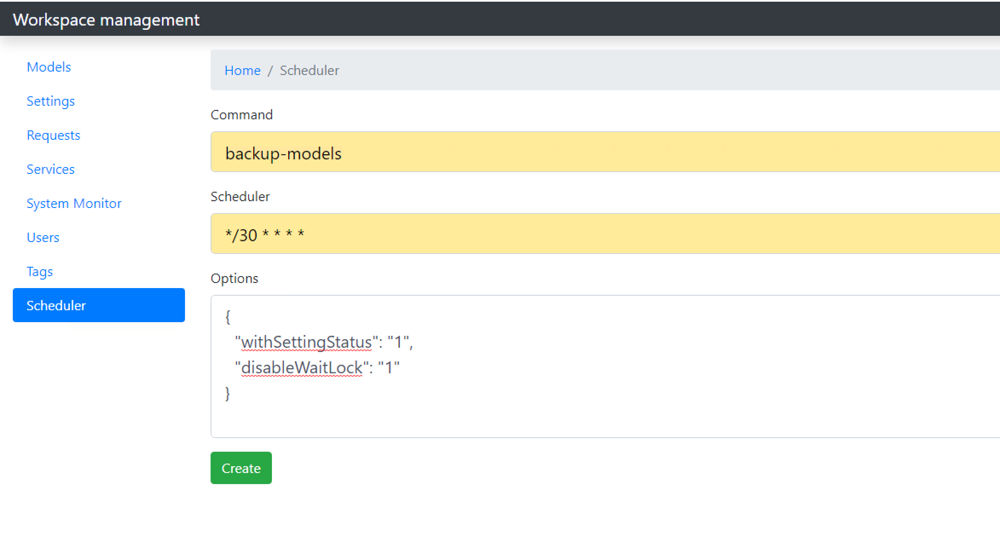

# Экспертиза:

Экспертиза проблем возникающих в ходе установок дистрибутивов либо их обновления на клиентских серверах.

## CentOS 8:
### Перед установкой системы контейнеризации Docker на Centos 8, проверьте следующие пункты:
Если ваша ОС управляется firewalld, то проверьте наличие включенного маскарада. В случае включенного маскарада, 
результат команды `firewall-cmd --zone=public --query-masquerade` должен быть `yes`. Для включения маскарада используйте
 команду `firewall-cmd --zone=public --add-masquerade --permanent`
***

## Не работает приложение:
### Белый экран бесконечное вращение лоадера:

Инструкция для решения проблемы: белый экран, бесконечная крутилка, вебсокет не работает.
- Перейти в директорию контейнера воркспейса cd /opt/om/workspace1/contaner
- Зайти в SSH терминал контейнера vagrant ssh

! Далее все пункты и команды осуществляются из командной строки контейнера

- Повысить свои права до root sudo su
- Проверить статус сервиса ws-server systemctl status ws-server
- Зеленый (active, running) - значит эта инструкция не решит проблему и дальше не нужно следовать инструкции. Нам нужен красный статус (failed).
- Перезагружаем сервис systemctl restart ws-server
- Смотрим статус сервиса, теперь он должен быть зеленым systemctl status ws-server
- Входим под пользователя optimacros_middlework su optimacros_middlework
- Переходим в директорию приложения cd ~/optimacros_middlework
- Выполняем команду console/command workspace-maintenance --stop
- Проверяем результат в браузере
- Закрываем терминал

***

## Не пескает в модель:
### Ошибка связанная с тем, что автобекапирование перестало работать

Проблема заключается в том, что на сервере в контейнере упал сервис scheduler-server нужно зайти на сервер в контейнер:

`cd /op/om/workspace1/container`

`vagrant ssh`

Далее в контейнере нужно перейти под root через команду `sudo su`. Так как в входе в контейнер ты будешь под 
пользователем vagrant
Далее выполняем команды:

`systemctl start scheduler-server`

`systemctl status scheduler-server`
И проверяем, что сервис имеет активное состояние.

Затем переходим под пользователя optimacros_middlework, используя команду

`su optimacros_middlework`

Далее нужно перейти в директорию приложения командой

`cd ~/optimacros_middlework`

Далее нужно выполнить команду 

`console/command backup-models`

Дождаться результата, после чего проверить вход модель через фронтенд в браузере, должно стать всё заработать.

далее идём в админку воркспейса /admin/scheduler
И создаём новый заполняя как на скриншоте:

Теперь автобекапирование включено, после чего было бы не плохо убедиться что бекапы создаются

время в разделе шедулер указывается +3 часа от МСК

work in progress...
  
[Вернуться к оглавлению <<](index.md)