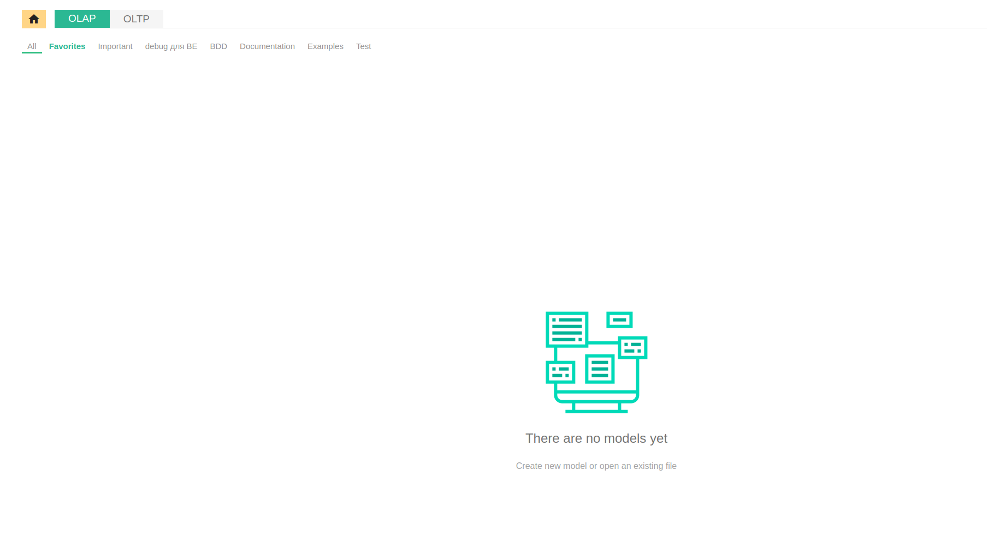

# Введение:

Данный мануал служит для организации структурированной документации по установке и обновлению дистрибутивов, 
документирования экспертизы проблем возникающих в ходе установок на серверах с различными операционными системами.

  
[Вернуться к оглавлению <<](index.md)