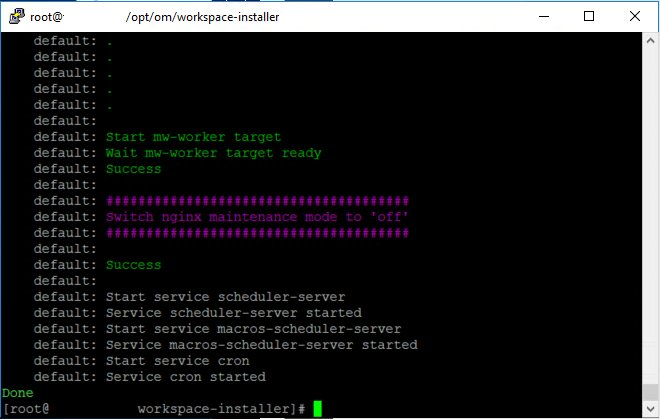
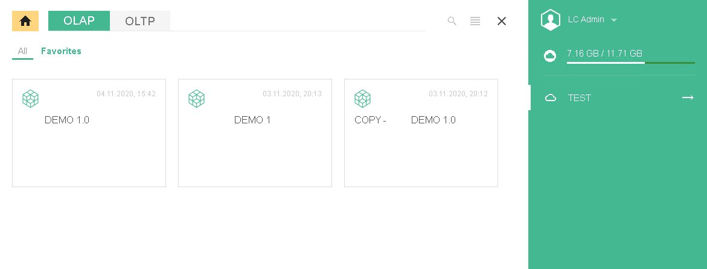

# Обновление уже установленной версии дистрибутива Optimacros:

Рассмотрим пример обновления новой версии дистрибутива Optimacros на клиентском сервере:

Как правило, почти у всех клиентов в целях безопасности, нет прямого доступа к серверу и установка новой версии 
дистрибутива начинается в подключения к сети VPN. В этом отношении у разных клиентов могут быть разные клиенты для 
предоставления VPN доступов FortiClient VPN, Open VPN, Cisco и т.д.

Попав в сеть VPN, мы получаем доступ к серверу на котором установлена старая версия дистрибутива. Далее нам нужно залить
 новую версию дистрибутива на машину, которая находится в VPN сети. Обычно, через FTP соединение. Получить актуальную 
 версию дистрибутива мы можем на облачном хранилище Optimacros в директории:```OM_DISTS/WORKSPACE/builds```

Самая актуальная версия будет в директории с наибольшим по индексу числом в имени:


Далее переходим в директории и скачиваем файл с именем ```installer-***.tar``` где *** это идентификатор версии.

После чего мы должны залить этот файл со своего компьютера на клиентский компьютер находящийся в VPN сети. Чаще всего 
для этого используется WinSCP клиент.


 
Затем мы должны подключиться к серверу через протокол ssh в основном это делается с помощью Putty, введя логин и пароль 
и перейдя в режим супер пользователя с помощью команды ```sudo su``` Проверяем что дистрибутив залился с помощью команды
```ls``` переходим в директорию ```/opt/om/``` в которой мы увидим директорию установленного логин центра 
```login-center```, директорию установленного воркспейса ```workspace1``` и директорию с дистрибутивами 
```workspace-installer```, внутри которой есть две директории ```prev``` и ```current```.


В директории ```prev``` мы можем увидеть файлы предыдущей версии дистрибутива установленной на этом сервере, а в папке 
```current``` будет находиться та которая версия установлена на данный момент.

Далее мы должны будем удалить директорию ```prev``` с помощью команды ```rm -rf prev/```, а содержимое ```current``` 
поместить во вновь созданную директорию ```prev``` с помощью команды ```mv current prev```. После этого у нас останется 
только директория ```prev``` содержащая файлы текущего установленного дистрибутива. Теперь создаём новую директорию 
```current``` командой ```mkdir current```, затем мы должны распаковать tar архив создав новую директорию ```current```
это мы делаем с помощью команды:

```tar -xf /home/user/installer-132.tar -C current```


Теперь у нас есть новая директория ```current``` в которой будет находиться содержимое архива новой актуальной версии 
дистрибутива Optimacros. Из неё мы и будем производить установку, но для начала нам нужно остановить работу воркспейса,
 создав бекапы моделей. Это делается с помощью команды:
 
```current/install workspace --path /opt/om/workspace1/manifest.json shutdown```


Если после ввода команды мы увидели в командной строке зелёную строку текста: 

```Load manifest '/opt/om/workspace1/manifest.json'```


Значит мы ввели команду правильно и находимся на верном пути, далее нам нужно ожидать пока создадутся бекапы моделей и 
остановится воркспейс.


По завершению всех операций, вывод консоли будет выглядеть вот так:


Далее на нужно запустить команду, которая восстановит все клиентские модели из бекапов и запустит воркспейс:

```current/install workspace --path /opt/om/workspace1/manifest.json up```


Время ожидания будет напрямую зависеть от размера и количества моделей у клиентов. В случае успеха, мы сможем увидеть 
вот такой вывод терминала:



После чего следует удостовериться, что вокрспейс поднялся успешно и убедиться у работоспособности Optimacros'а. 
Открываем клиентскую логин панель и авторизуемся под любым пользователем.




Если после авторизации становится доступным воркспейс и открывается без ошибок, значит установка новой версии 
дистрибутива подошла к концу. После этого желательно удалить на сервере архив с дистрибутивом, который мы загружали с 
помощью WinSCP, в целях экономии места.

[Вернуться к содержанию <](contents.md)

[Вернуться к оглавлению <<](index.md)
